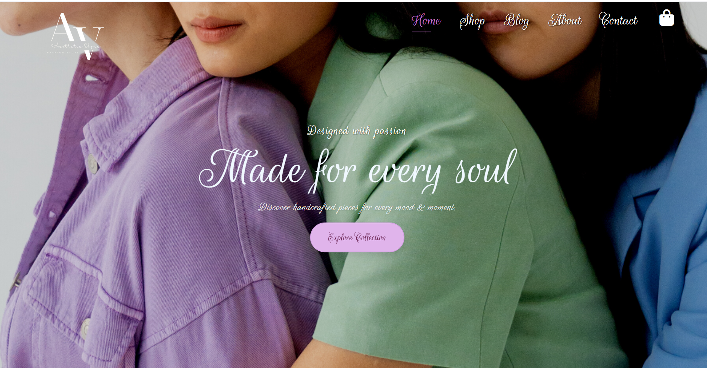
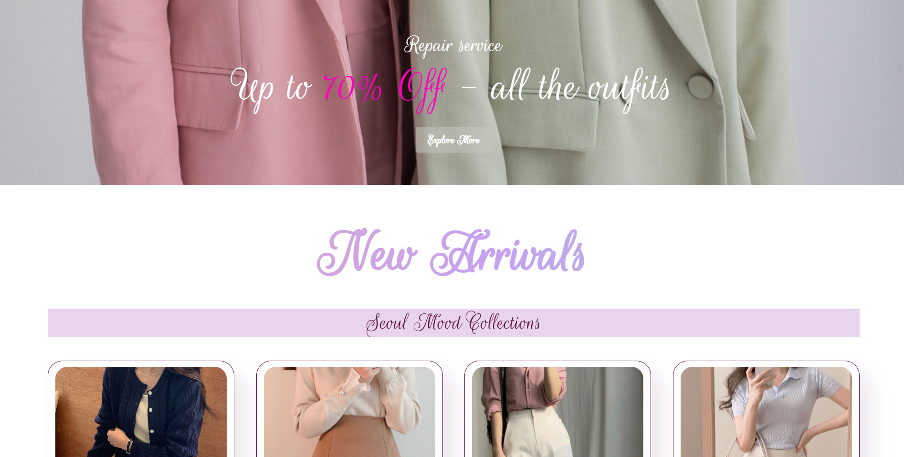
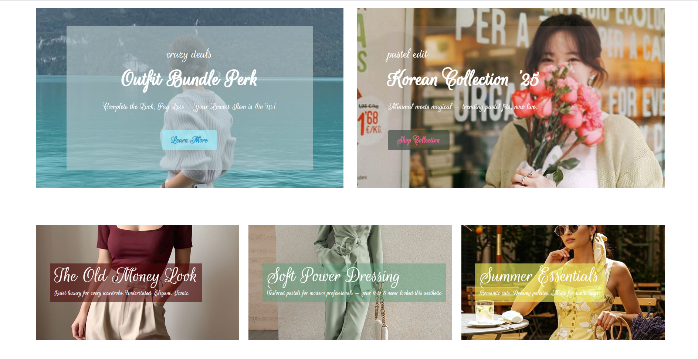
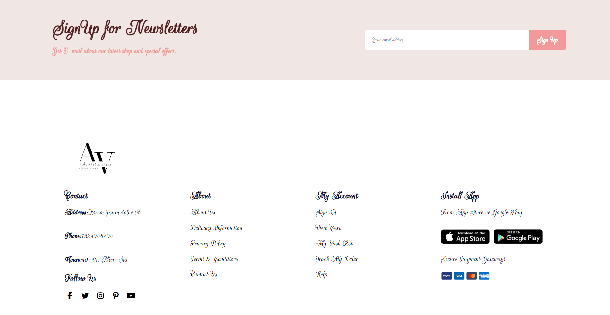

# Aesthetic Vogue 👗✨

**Aesthetic Vogue** is a modern, elegant fashion website showcasing curated clothing collections. Designed with minimalism and interactivity in mind, this project offers a sleek user experience, responsive layout, and clean navigation—ideal for a stylish online clothing brand.

---

## 🌐 Live Site

🔗 [Visit Live Website](https://aesthetic-vogue.netlify.app)

---

## 🎥 Project Demo

https://github.com/your-username/aesthetic-vogue/assets/main/project-demo.mp4  

---

## 🖼️ Website Screenshots

### 🏠 Homepage

### 👗 Featured Products

### 📱 Mobile Navigation

### 🛍️ Shop Page

### 🎯 Product Preview Switch

---

## 🛠 Tech Stack

- **HTML5** – Structure & semantic layout
- **CSS3** – Styling with Flexbox, Grid & media queries
- **JavaScript (Vanilla)** – Navbar toggle & product image preview
- **Netlify** – Deployment & hosting

---

## ✨ Features

- ✅ Clean, elegant homepage layout
- ✅ Interactive product gallery (click to change image)
- ✅ Mobile-friendly navigation bar with hamburger toggle
- ✅ Separate Shop page with featured items and pricing
- ✅ Smooth hover effects and transitions
- ✅ Responsive design across devices

---

## 📁 Folder Structure

